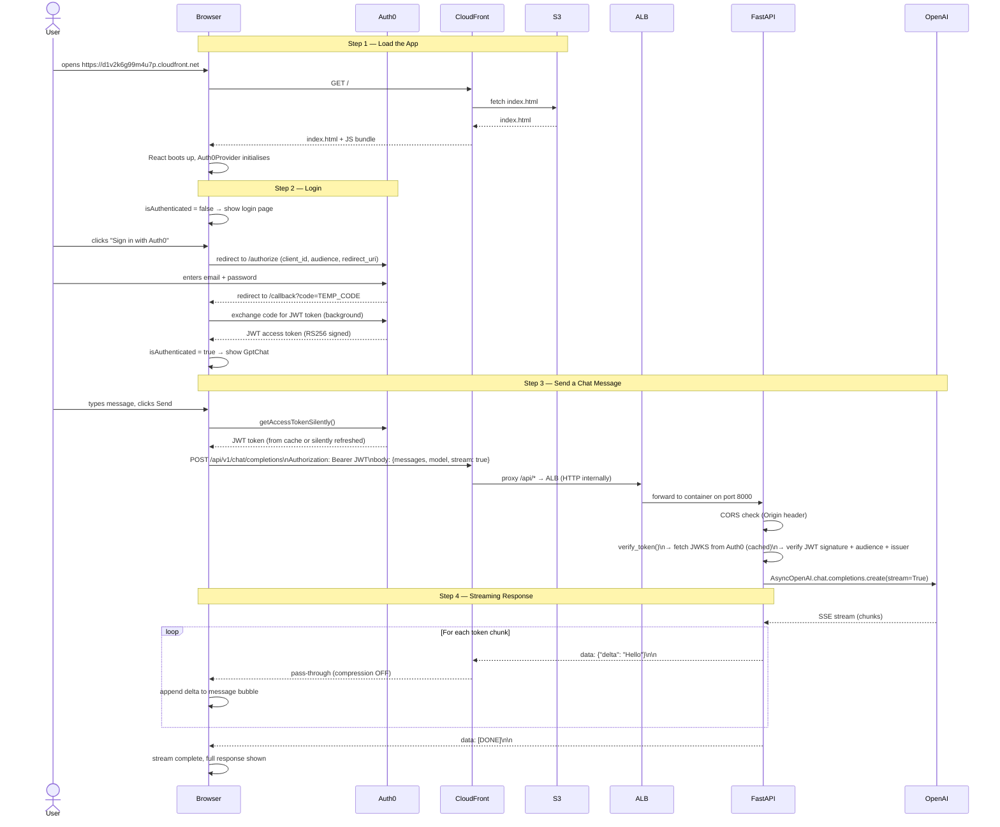

# GPT FastAPI Application — Full Documentation

---

## Table of Contents

1. [Project Overview](#1-project-overview)
2. [Folder Structure](#2-folder-structure)
3. [Frontend Flow Diagram](#3-frontend-flow-diagram)
4. [Backend Flow Diagram](#4-backend-flow-diagram)
5. [Full End-to-End Flow Diagram](#5-full-end-to-end-flow-diagram)
6. [Frontend — Detailed Walkthrough](#6-frontend--detailed-walkthrough)
7. [Backend — Detailed Walkthrough](#7-backend--detailed-walkthrough)
8. [Authentication Flow (Auth0)](#8-authentication-flow-auth0)
9. [Streaming vs Non-Streaming](#9-streaming-vs-non-streaming)
10. [Environment Variables](#10-environment-variables)
11. [API Reference](#11-api-reference)
12. [Running Locally](#12-running-locally)

---

## 1. Project Overview

This is a full-stack AI chat application that allows authenticated users to have conversations with OpenAI's GPT models. Here's the simple summary:

```
User → React UI → FastAPI Backend → OpenAI → Response back to User
```

**Key features:**
- Auth0 SSO login (users must be authenticated to chat)
- Real-time streaming responses (words appear as they are generated)
- Non-streaming mode (full response returned at once)
- Configurable model, temperature, token limit, and system prompt
- Memory toggle (send full conversation history or just the latest message)

**Tech stack:**

| Layer | Technology |
|---|---|
| Frontend | React 18, Vite, Tailwind CSS, `@auth0/auth0-react` |
| Backend | FastAPI, Python 3.11, uvicorn |
| Auth | Auth0 (JWT RS256 tokens) |
| AI | OpenAI API (`gpt-3.5-turbo`, `gpt-4`, etc.) |
| Deployment | Docker, AWS ECS Fargate (backend), S3 + CloudFront (frontend) |

---

## 2. Folder Structure

```
gpt_fastapi_application/
├── application/
│   ├── backend/
│   │   ├── app/
│   │   │   ├── main.py              ← FastAPI app factory + CORS + lifespan
│   │   │   ├── api/
│   │   │   │   └── v1/
│   │   │   │       └── router.py    ← mounts health + chat routers
│   │   │   ├── routes/
│   │   │   │   ├── chat.py          ← POST /api/v1/chat/completions
│   │   │   │   └── health.py        ← GET  /api/v1/health
│   │   │   ├── schemas/
│   │   │   │   └── chat.py          ← Pydantic models (request/response shapes)
│   │   │   ├── services/
│   │   │   │   └── openai_service.py← calls OpenAI API (streaming + standard)
│   │   │   └── core/
│   │   │       ├── config.py        ← settings loaded from .env
│   │   │       ├── logging.py       ← JSON structured logging
│   │   │       └── security.py      ← JWT validation (Auth0 JWKS)
│   │   ├── run.py                   ← entry point for local dev
│   │   ├── requirements.txt
│   │   ├── Dockerfile
│   │   └── .env                     ← local secrets (never committed)
│   │
│   └── frontend/
│       ├── src/
│       │   ├── main.jsx             ← React root + Auth0Provider
│       │   ├── App.jsx              ← auth gate (login screen or GptChat)
│       │   ├── components/
│       │   │   └── GptChat.jsx      ← main chat UI (messages, settings, stream)
│       │   ├── services/
│       │   │   └── api.js           ← fetch calls to backend
│       │   └── index.css            ← Tailwind + global styles
│       ├── index.html
│       ├── vite.config.js
│       ├── tailwind.config.js
│       ├── package.json
│       └── .env                     ← VITE_ prefixed env vars
│
├── .github/
│   └── workflows/
│       ├── deploy-backend.yml       ← CI/CD: build Docker → ECR → ECS
│       └── deploy-frontend.yml      ← CI/CD: npm build → S3 → CloudFront
│
├── .gitignore
├── DEPLOYMENT.md                    ← AWS deployment guide
└── APPLICATION_DOCS.md              ← this file
```

---

## 3. Frontend Flow Diagram

```mermaid
flowchart TD
    A([Browser opens app]) --> B[main.jsx\nReact mounts Auth0Provider]
    B --> C{Auth0\nSession check}

    C -- No session --> D[App.jsx\nShow Login Screen]
    D --> E[User clicks\nSign in with Auth0]
    E --> F[loginWithRedirect\nBrowser goes to Auth0]
    F --> G[Auth0 login page\nEnter credentials]
    G --> H[Auth0 redirects back\nto /callback with code]
    H --> I[@auth0/auth0-react\nexchanges code for JWT token\nstored in memory]

    C -- Has session --> J[App.jsx\nrender GptChat component]
    I --> J

    J --> K[GptChat.jsx\nshows chat UI]

    K --> L[User types message\nand clicks Send]
    L --> M[getAccessTokenSilently\nfetch JWT from Auth0 cache]
    M --> N{stream mode?}

    N -- stream=true --> O[api.js sendChatStream\nfetch POST\nAuthorization: Bearer JWT]
    N -- stream=false --> P[api.js sendChatCompletion\nfetch POST\nAuthorization: Bearer JWT]

    O --> Q[Read response body\nas a stream\nReadableStream + TextDecoder]
    Q --> R[Parse SSE lines\ndata: JSON delta\nUpdate message bubble\nlive as tokens arrive]
    R --> S{data: DONE?}
    S -- No --> Q
    S -- Yes --> T[Stream complete\nmessage fully shown]

    P --> U[await JSON response\nadd full message\nto messages array]
    T --> V[UI updated\nready for next message]
    U --> V
```

### Key files involved

| Step | File | What it does |
|---|---|---|
| App boot | `main.jsx` | Mounts React, wraps app in `Auth0Provider` with domain + clientId + audience |
| Auth gate | `App.jsx` | Checks `isLoading`, `isAuthenticated` → shows spinner, login page, or chat |
| Chat UI | `GptChat.jsx` | Manages all state: messages, model, temperature, tokens, stream mode, memory |
| API calls | `services/api.js` | `sendChatCompletion()` and `sendChatStream()` — attaches JWT to every request |

---

## 4. Backend Flow Diagram

```mermaid
flowchart TD
    A([HTTP Request arrives\nPOST /api/v1/chat/completions]) --> B[FastAPI CORS Middleware\ncheck Origin header\nagainst allowed list]

    B -- Origin not allowed --> C[403 Forbidden]
    B -- Origin allowed --> D[app/api/v1/router.py\nroute matched to chat_completions]

    D --> E[core/security.py\nverify_token dependency\nextract Bearer token]

    E --> F{JWKS cache\nloaded?}
    F -- No --> G[Fetch Auth0 JWKS\nGET auth0domain/.well-known/jwks.json\ncache in memory]
    G --> H
    F -- Yes --> H[Match token kid\nto public key in JWKS]

    H -- No matching key --> I[401 Unauthorized]
    H -- Key found --> J[jwt.decode\nverify: signature\naudience\nissuer\nexpiry]

    J -- Invalid --> K[401 Unauthorized]
    J -- Valid --> L[return decoded payload\nuser sub email etc]

    L --> M[routes/chat.py\nchat_completions handler\nreceive ChatRequest + user payload]

    M --> N{request.stream?}

    N -- True --> O[services/openai_service.py\nstream_chat\nAsyncOpenAI.chat.completions.create\nstream=True]
    N -- False --> P[services/openai_service.py\ncomplete_chat\nAsyncOpenAI.chat.completions.create]

    O --> Q[async for chunk in stream\nyield SSE line\ndata: {delta: token}\n\n]
    Q --> R{More chunks?}
    R -- Yes --> Q
    R -- No --> S[yield data: DONE\n\n]
    S --> T[StreamingResponse\nmedia_type: text/event-stream]

    P --> U[await OpenAI response\nbuild ChatResponse\nid + model + content + usage]
    U --> V[JSON Response\n200 OK]
```

### Key files involved

| File | Role |
|---|---|
| `app/main.py` | Creates FastAPI app, adds CORS middleware, mounts router |
| `app/core/config.py` | Reads all env vars from `.env` (api key, Auth0 settings, CORS origins) |
| `app/core/security.py` | Fetches Auth0 public keys, validates JWT signature + claims |
| `app/api/v1/router.py` | Combines health + chat routers under `/api/v1` |
| `app/routes/chat.py` | Route handler — checks `stream` flag, delegates to service |
| `app/routes/health.py` | `GET /api/v1/health` — returns status, version, env |
| `app/schemas/chat.py` | Pydantic models — validates incoming JSON, defines response shape |
| `app/services/openai_service.py` | Calls OpenAI API — builds message list, handles streaming |
| `app/core/logging.py` | JSON structured logging with `python-json-logger` |

---

## 5. Full End-to-End Flow Diagram



### In plain words — what happens step by step

```
1. User opens the app URL
      └─ CloudFront serves the React HTML/JS from S3

2. React starts up
      └─ Auth0Provider checks for an existing session

3. No session → Login page is shown
      └─ User clicks "Sign in with Auth0"
      └─ Browser redirects to Auth0's login page
      └─ After login, Auth0 gives back a JWT token
      └─ React now shows the chat interface

4. User types a message and clicks Send
      └─ React calls getAccessTokenSilently() → gets JWT
      └─ React sends POST /api/v1/chat/completions
         with Authorization: Bearer <JWT>

5. Request travels: Browser → CloudFront → ALB → FastAPI
      └─ FastAPI checks CORS (is the origin allowed?)
      └─ FastAPI validates the JWT (signature, audience, expiry)
      └─ FastAPI builds the messages list + calls OpenAI

6. OpenAI streams back the response token by token
      └─ FastAPI wraps each token in SSE format: data: {"delta": "word"}
      └─ Browser reads the stream and appends each word to the chat bubble
      └─ User sees the response being typed in real-time

7. Stream ends with: data: [DONE]
      └─ Message is complete, ready for the next message
```

---

## 6. Frontend — Detailed Walkthrough

### `main.jsx` — App entry point

The very first file that runs. It:
1. Creates the React root element in `index.html`'s `<div id="root">`
2. Wraps the entire app in `<Auth0Provider>` — this makes `useAuth0()` available everywhere
3. Passes Auth0 config from `.env` variables

```jsx
// Reads these from .env
const domain   = import.meta.env.VITE_AUTH0_DOMAIN
const clientId = import.meta.env.VITE_AUTH0_CLIENT_ID
const audience = import.meta.env.VITE_AUTH0_AUDIENCE
```

### `App.jsx` — Authentication gate

Acts as a router based on auth state. Three possible states:

| State | What renders |
|---|---|
| `isLoading = true` | Spinning loader (Auth0 is checking session) |
| `isAuthenticated = false` | Login page with "Sign in with Auth0" button |
| `isAuthenticated = true` | `<GptChat />` component |

### `GptChat.jsx` — Main chat component

This is the largest component (~800 lines). It manages:

**State variables:**

| State | Type | Purpose |
|---|---|---|
| `messages` | array | Full conversation history shown in UI |
| `inputText` | string | Current value of the textarea |
| `temperature` | float | Passed to API (0 = precise, 2 = creative) |
| `maxTokens` | int | Max tokens the AI can reply with |
| `selectedModel` | string | Which GPT model to use |
| `memoryOn` | bool | If true, sends full history; if false, sends only latest message |
| `systemPrompt` | string | Optional system-level instruction |
| `streamMode` | bool | If true, uses SSE streaming; if false, waits for full response |
| `isTyping` | bool | Shows the animated "..." indicator |
| `errorMsg` | string/null | Error banner at top of chat |

**`handleSend()` — the core function** (called when user clicks Send or presses Enter):

```
1. Prevent duplicate sends (if already typing)
2. Add user message to messages array
3. Call getAccessTokenSilently() → get JWT
4. Build API messages (with or without history based on memoryOn)
5a. If streamMode: call sendChatStream() → insert empty bubble, fill it token by token
5b. If !streamMode: call sendChatCompletion() → wait, then insert full message
```

**Memory toggle behaviour:**
- `memoryOn = true` → sends all previous messages to OpenAI (AI remembers context)
- `memoryOn = false` → sends only the latest user message (AI has no context)

### `services/api.js` — HTTP client

Two exported functions:

**`sendChatCompletion()`** — for non-streaming:
```
POST /api/v1/chat/completions
body: { messages, model, temperature, max_tokens, system_prompt, stream: false }
→ awaits full JSON response
→ returns data.content (the assistant reply string)
```

**`sendChatStream()`** — for streaming:
```
POST /api/v1/chat/completions
body: { ..., stream: true }
→ reads response as a ReadableStream
→ buffers and splits by newlines
→ parses each "data: {...}" SSE line
→ calls onDelta(token) for each chunk
→ calls onDone() when "data: [DONE]" received
→ calls onError(msg) if something fails
```

---

## 7. Backend — Detailed Walkthrough

### `app/main.py` — FastAPI factory

Creates the FastAPI application with:
- **Lifespan**: sets up JSON logging on startup, logs shutdown
- **CORS Middleware**: only allows origins listed in `CORS_ORIGINS` env var
- **Router**: mounts `api_router` at prefix `/api/v1`
- **Docs**: available at `/docs` (Swagger UI) and `/redoc`

### `app/core/config.py` — Settings

Uses `pydantic-settings` to read environment variables. All settings loaded once and cached:

| Setting | Env var | Default |
|---|---|---|
| App environment | `APP_ENV` | `development` |
| Debug mode | `APP_DEBUG` | `true` |
| OpenAI key | `OPENAI_API_KEY` | `""` |
| Allowed origins | `CORS_ORIGINS` | localhost:5173, 3000 |
| Auth0 domain | `AUTH0_DOMAIN` | `""` |
| Auth0 audience | `AUTH0_AUDIENCE` | `""` |
| API prefix | `API_V1_PREFIX` | `/api/v1` |

### `app/core/security.py` — JWT Validation

This is how the backend verifies that a request is from a real logged-in user.

**Flow:**
```
1. HTTPBearer extracts the token from "Authorization: Bearer <token>"
2. Fetch Auth0 public keys (JWKS) — only fetched once, cached in memory
3. Read the token header to get "kid" (key ID)
4. Find the matching public key from JWKS
5. jwt.decode() — verifies:
     - Signature (was this token really signed by Auth0?)
     - Audience (is this token meant for our API?)
     - Issuer (does it come from our Auth0 tenant?)
     - Expiry (is the token still valid?)
6. Return the decoded payload: { "sub": "user-id", "email": "...", ... }
```

**Why RS256?** Auth0 uses asymmetric cryptography. Auth0 signs tokens with a **private key** (only they have it). The backend verifies using the corresponding **public key** (fetched from JWKS). This means no one can forge a token without Auth0's private key.

### `app/schemas/chat.py` — Request/Response models

Pydantic automatically validates the incoming JSON and returns clear error messages for invalid inputs.

**`ChatRequest` — what the frontend must send:**
```json
{
  "messages": [
    { "role": "user", "content": "Hello" }
  ],
  "model": "gpt-3.5-turbo",
  "temperature": 0.7,
  "max_tokens": 8000,
  "system_prompt": null,
  "stream": false
}
```

**`ChatResponse` — what the backend returns (non-streaming):**
```json
{
  "id": "chatcmpl-abc123",
  "model": "gpt-3.5-turbo",
  "content": "Hello! How can I help you?",
  "usage": {
    "prompt_tokens": 10,
    "completion_tokens": 8,
    "total_tokens": 18
  }
}
```

**For streaming** — the response body is an SSE stream:
```
data: {"delta": "Hello"}

data: {"delta": "!"}

data: {"delta": " How"}

data: [DONE]
```

### `app/services/openai_service.py` — OpenAI integration

**`_build_openai_messages()`** — constructs the message list for OpenAI:
```
If system_prompt is provided → add as first message with role "system"
Then append all conversation messages from the request
```

**`complete_chat()`** — standard (non-streaming):
```
await client.chat.completions.create(...)
→ returns full response
→ maps to ChatResponse pydantic model
```

**`stream_chat()`** — streaming (async generator):
```
await client.chat.completions.create(..., stream=True)
→ async for chunk in stream:
      extract delta text from chunk
      yield f"data: {json.dumps({'delta': delta})}\n\n"
→ yield "data: [DONE]\n\n"
```

### `app/core/logging.py` — JSON structured logging

Every log line is a JSON object, making it easy to filter in CloudWatch:
```json
{
  "timestamp": "2026-04-12T10:23:01Z",
  "level": "INFO",
  "logger": "cortex.routes.chat",
  "env": "production",
  "app_version": "1.0.0",
  "message": "Request from user sub=auth0|abc123"
}
```

Pass extra fields with:
```python
logger.info("chat completed", extra={"user_id": "auth0|abc", "tokens": 312})
```

---

## 8. Authentication Flow (Auth0)

```
Frontend                    Auth0                    Backend
────────                    ─────                    ───────

1. loginWithRedirect() ──────────────────►
                            User logs in
                      ◄──── redirect to /callback?code=xyz

2. Exchange code ─────────────────────────►
                      ◄──── JWT token (RS256, signed by Auth0)

3. JWT stored in memory (per @auth0/auth0-react)

4. User sends message
   getAccessTokenSilently() ──────────────►
                      ◄──── JWT (from cache or silently refreshed)

5. POST /api/v1/chat/completions
   Authorization: Bearer JWT ────────────────────────────────────►

6.                                          verify_token():
                                            fetch JWKS from Auth0 ──►
                                                              ◄── public keys
                                            decode + verify JWT
                                            ✓ signature valid
                                            ✓ audience matches
                                            ✓ issuer matches
                                            ✓ not expired
                                            → return user payload

7.                                          call OpenAI...
```

**JWT structure** (3 parts, base64 encoded, separated by `.`):
```
HEADER.PAYLOAD.SIGNATURE
```
- **Header**: algorithm (RS256) + key ID (kid)
- **Payload**: claims — `sub` (user ID), `aud` (audience), `iss` (issuer), `exp` (expiry)
- **Signature**: Auth0's cryptographic proof that the header+payload weren't tampered with

---

## 9. Streaming vs Non-Streaming

### Non-streaming (`stream: false`)

```
Client                          Backend                         OpenAI
──────                          ───────                         ──────

POST /chat/completions ──────►
                                POST to OpenAI ──────────────►
                                                    ←────────── wait...
                                                    ←────────── wait...
                                                    ←────────── full response
                                ◄──────────────────────────────
◄────────────────────────────── JSON response (complete)

UI: Show full message at once
```

### Streaming (`stream: true`)

```
Client                          Backend                         OpenAI
──────                          ───────                         ──────

POST /chat/completions ──────►
                                POST to OpenAI (stream=True) ►
                                ◄── chunk "Hello"
◄── data: {"delta": "Hello"}
UI updates: "Hello"
                                ◄── chunk " world"
◄── data: {"delta": " world"}
UI updates: "Hello world"
                                ◄── chunk "!"
◄── data: {"delta": "!"}
UI updates: "Hello world!"
                                ◄── [DONE]
◄── data: [DONE]
Stream closed. Full message shown.
```

**Why streaming is preferred:**
- User sees the response immediately, word by word (feels faster even if total time is similar)
- Works better for long responses — no long blank wait
- Matches the ChatGPT experience users expect

**CloudFront settings needed for streaming:**
- Compression: **OFF** on the `/api/*` behaviour (gzip would buffer chunks)
- Origin response timeout: **60 seconds** (AI can take time for long responses)

---

## 10. Environment Variables

### Backend `.env`

| Variable | Required | Example | Purpose |
|---|---|---|---|
| `OPENAI_API_KEY` | Yes | `sk-proj-...` | OpenAI API authentication |
| `APP_ENV` | No | `development` | Affects log level and debug features |
| `APP_DEBUG` | No | `true` | `true` = DEBUG logs, `false` = INFO logs only |
| `CORS_ORIGINS` | Yes | `["http://localhost:5173"]` | Which frontend origins can call the API |
| `AUTH0_DOMAIN` | Yes | `dev-xxx.us.auth0.com` | Auth0 tenant domain for JWKS fetch |
| `AUTH0_AUDIENCE` | Yes | `http://localhost:8000` | Expected `aud` claim in JWT (must match exactly) |
| `AUTH0_CLIENT_ID` | Yes | `KVdyn...` | Auth0 app client ID |

### Frontend `.env`

| Variable | Required | Example | Purpose |
|---|---|---|---|
| `VITE_API_BASE_URL` | Yes | `http://localhost:8000/api/v1` | Where to send API calls |
| `VITE_AUTH0_DOMAIN` | Yes | `dev-xxx.us.auth0.com` | Auth0 tenant for login |
| `VITE_AUTH0_CLIENT_ID` | Yes | `KVdyn...` | Auth0 app client ID |
| `VITE_AUTH0_AUDIENCE` | Yes | `http://localhost:8000` | Requested audience for JWT (must match backend) |

> **Important:** `VITE_AUTH0_AUDIENCE` in the frontend must exactly match `AUTH0_AUDIENCE` in the backend including any trailing slash.

---

## 11. API Reference

### `GET /api/v1/health`

No authentication required.

**Response:**
```json
{
  "status": "ok",
  "version": "1.0.0",
  "environment": "production"
}
```

---

### `POST /api/v1/chat/completions`

Authentication required — `Authorization: Bearer <JWT>`

**Request body:**

```json
{
  "messages": [
    { "role": "system",    "content": "You are a helpful assistant." },
    { "role": "user",      "content": "What is FastAPI?" },
    { "role": "assistant", "content": "FastAPI is a Python web framework." },
    { "role": "user",      "content": "How is it different from Flask?" }
  ],
  "model":         "gpt-3.5-turbo",
  "temperature":   0.7,
  "max_tokens":    8000,
  "system_prompt": "Answer concisely.",
  "stream":        false
}
```

| Field | Type | Required | Default | Constraints |
|---|---|---|---|---|
| `messages` | array | Yes | — | Min 1 item |
| `messages[].role` | string | Yes | — | `"system"`, `"user"`, or `"assistant"` |
| `messages[].content` | string | Yes | — | Min length 1 |
| `model` | string | No | `gpt-3.5-turbo` | Any valid OpenAI model ID |
| `temperature` | float | No | `0.7` | 0.0 – 2.0 |
| `max_tokens` | int | No | `8000` | 1 – 128,000 |
| `system_prompt` | string | No | `null` | Injected before messages as `role: system` |
| `stream` | bool | No | `false` | `true` = SSE streaming |

**Non-streaming response (200 OK):**
```json
{
  "id":    "chatcmpl-abc123",
  "model": "gpt-3.5-turbo",
  "content": "FastAPI differs from Flask in that it...",
  "usage": {
    "prompt_tokens":      45,
    "completion_tokens":  32,
    "total_tokens":       77
  }
}
```

**Streaming response (200 OK, `Content-Type: text/event-stream`):**
```
data: {"delta": "FastAPI"}

data: {"delta": " differs"}

data: {"delta": " from"}

data: [DONE]
```

**Error responses:**

| Status | When |
|---|---|
| 401 | Missing, expired, or invalid JWT token |
| 403 | CORS — request from origin not in allowed list |
| 422 | Request body failed Pydantic validation |
| 502 | OpenAI API returned an error |

---

## 12. Running Locally

### Backend

```bash
cd application/backend

# Create virtual environment
python -m venv venv
source venv/bin/activate

# Install dependencies
pip install -r requirements.txt

# Create .env file with your values
cp .env.example .env
# Edit .env: set OPENAI_API_KEY, AUTH0_DOMAIN, AUTH0_AUDIENCE

# Start the server
python run.py
# → http://localhost:8000
# → Swagger UI: http://localhost:8000/docs
```

### Frontend

```bash
cd application/frontend

# Install dependencies
npm install

# Create .env file
# Set VITE_API_BASE_URL, VITE_AUTH0_DOMAIN, VITE_AUTH0_CLIENT_ID, VITE_AUTH0_AUDIENCE

# Start dev server
npm run dev
# → http://localhost:5173
```

### Build frontend for production

```bash
npm run build
# Output in: dist/
```

### Docker (backend only)

```bash
cd application/backend

# Build
docker build -t gpt-app-backend .

# Run
docker run -p 8000:8000 \
  -e OPENAI_API_KEY=sk-proj-... \
  -e AUTH0_DOMAIN=dev-xxx.us.auth0.com \
  -e AUTH0_AUDIENCE=http://localhost:8000 \
  -e CORS_ORIGINS='["http://localhost:5173"]' \
  gpt-app-backend
```

---

*Documentation written for GPT FastAPI Application — April 2026*
