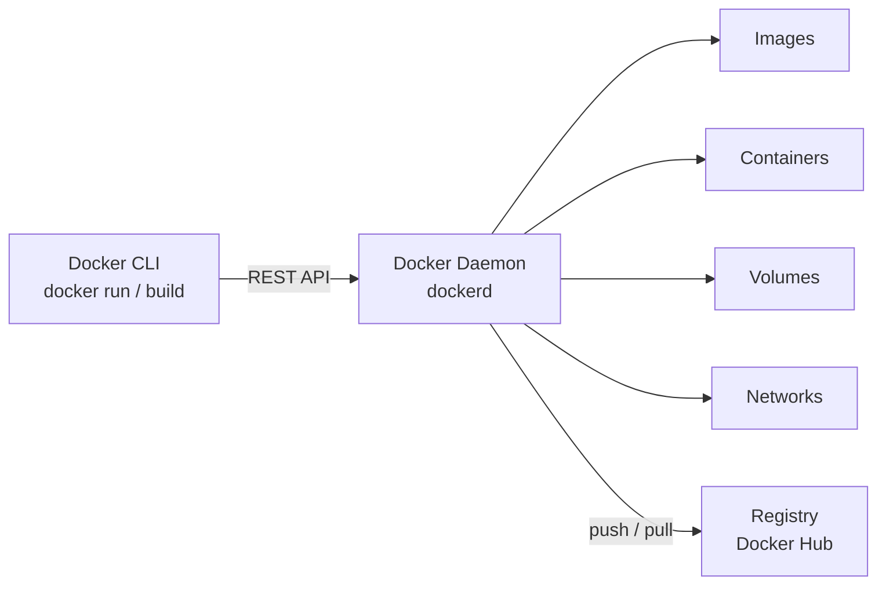
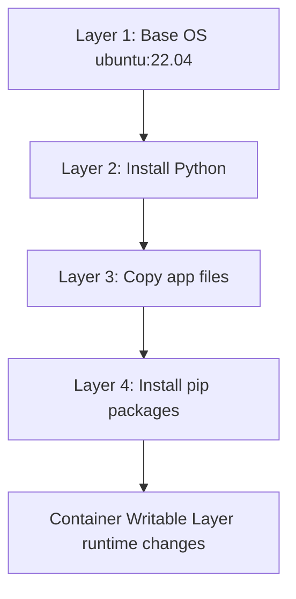
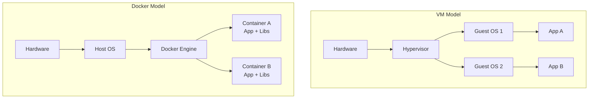
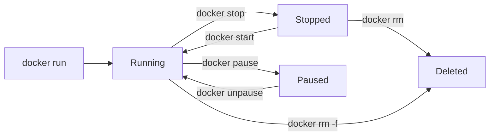
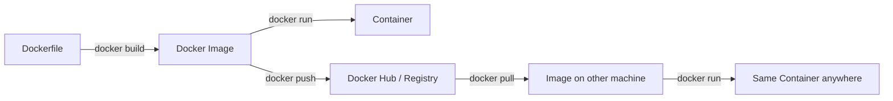
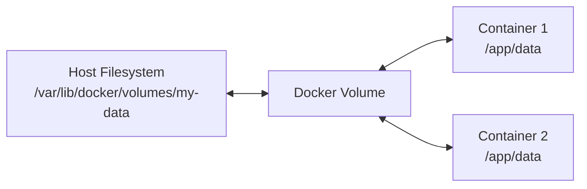
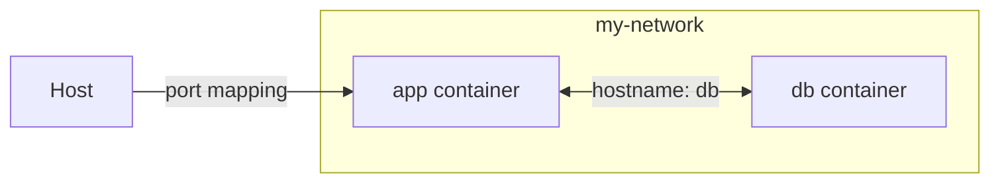
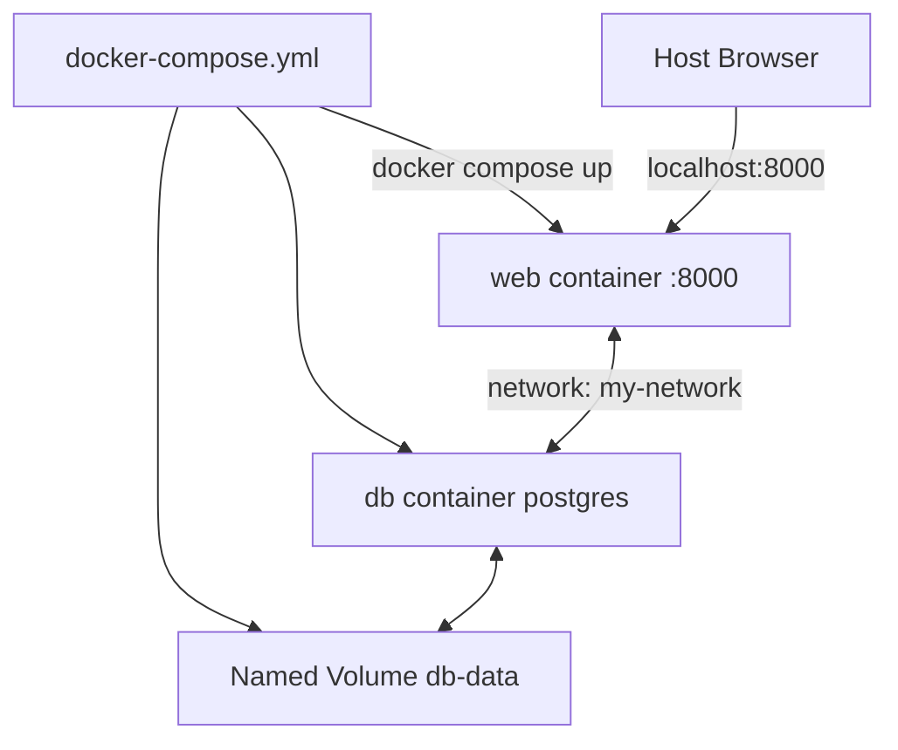

# Docker Training Guide (Basic to Intermediate)

## 1. Learning Goals
By the end of this guide, a fresher should be able to:
- Understand why Docker exists and the problem it solves.
- Build and run Docker containers confidently.
- Write Dockerfiles for real applications.
- Manage images, volumes, and networks.
- Use Docker Compose for multi-container setups.
- Follow container best practices used in real teams.

---

## 2. Why Docker? (The Problem Story)

### Before Docker — "It Works on My Machine"
Imagine this scenario:
- Developer builds an app on macOS with Python 3.10.
- Tester runs it on Ubuntu with Python 3.8 — app crashes.
- Production runs on CentOS — different library versions, different behaviour.
- Deployment takes hours of "fixing environment" issues.

This is the classic **"it works on my machine"** problem.

### What Docker Solves
Docker packages your application **along with everything it needs** — runtime, libraries, config — into a single portable unit called a **container**.

> "Build once, run anywhere" — same container runs identically on every machine.

### Real World Analogy
Think of a Docker container like a **shipping container**:
- A shipping container holds everything needed for delivery.
- It looks the same whether it's on a ship, truck, or train.
- The transport doesn't need to know what's inside.

Similarly, a Docker container holds your app and its dependencies, and runs the same on any machine that has Docker installed.

---

## 3. Core Concepts (Must Know)

| Term | Definition |
|------|------------|
| **Image** | Read-only blueprint/template to create containers. |
| **Container** | Running instance of an image. Isolated process. |
| **Dockerfile** | Script with instructions to build a custom image. |
| **Registry** | Storage for images (Docker Hub, AWS ECR, etc.). |
| **Volume** | Persistent storage that survives container restarts. |
| **Network** | Virtual network for containers to communicate. |
| **Docker Compose** | Tool to define and run multi-container apps. |
| **Layer** | Each instruction in Dockerfile creates a cacheable layer. |
| **Tag** | Version label for an image (`nginx:1.25`, `python:3.11-slim`). |
| **Daemon** | Background service (`dockerd`) that manages containers. |

---

## 4. Docker Architecture

### 4.1 High-Level Architecture


### 4.2 Image Layers (How Images Are Built)
Each Dockerfile instruction adds a new read-only layer on top.
Containers add a thin writable layer on top of these.



Key insight: layers are **cached**. If a layer hasn't changed, Docker reuses it — making builds fast.

### 4.3 Container vs Virtual Machine

| | Virtual Machine | Docker Container |
|--|-----------------|-----------------|
| Includes | Full OS + App | App + Libraries only |
| Size | GBs | MBs |
| Start time | Minutes | Seconds |
| Isolation | Hardware-level | Process-level |
| Use case | Full OS isolation | App packaging |



---

## 5. Installation and Setup

### Install Docker
- **macOS / Windows**: Install Docker Desktop from docker.com
- **Linux (Ubuntu)**:
```bash
sudo apt update
sudo apt install docker.io -y
sudo systemctl start docker
sudo systemctl enable docker
sudo usermod -aG docker $USER   # run docker without sudo
```

### Verify Installation
```bash
docker --version
docker info
docker run hello-world          # confirms everything works
```

---

## 6. Docker Images

### Pull an Image from Docker Hub
```bash
docker pull nginx               # pulls latest tag
docker pull python:3.11-slim    # pulls specific version
```

### List Local Images
```bash
docker images
docker image ls
```

### Inspect an Image
```bash
docker image inspect nginx
```

### Remove an Image
```bash
docker rmi nginx
docker image rm python:3.11-slim
docker image prune              # remove all dangling/unused images
```

### Search Docker Hub
```bash
docker search nginx
```

---

## 7. Docker Containers

### Run a Container
```bash
docker run nginx                         # runs in foreground
docker run -d nginx                      # detached (background)
docker run -d -p 8080:80 nginx           # map port 8080 on host to 80 in container
docker run -d --name my-nginx nginx      # give container a name
```

### Port Mapping Explained
```
Host Machine                Container
Port 8080         ------->  Port 80 (nginx)
localhost:8080              internal port
```

### List Containers
```bash
docker ps                   # running containers
docker ps -a                # all containers including stopped
```

### Stop, Start, Restart
```bash
docker stop my-nginx
docker start my-nginx
docker restart my-nginx
```

### Remove Containers
```bash
docker rm my-nginx                  # remove stopped container
docker rm -f my-nginx               # force remove running container
docker container prune              # remove all stopped containers
```

### Execute Commands Inside a Container
```bash
docker exec -it my-nginx bash       # open interactive shell
docker exec my-nginx ls /etc/nginx  # run single command
```

### View Container Logs
```bash
docker logs my-nginx
docker logs -f my-nginx             # follow live logs
docker logs --tail 50 my-nginx      # last 50 lines
```

### Inspect Container Details
```bash
docker inspect my-nginx
```

### Container Lifecycle Diagram


---

## 8. Dockerfile (Build Your Own Image)

### 8.1 What Is a Dockerfile?
A text file with step-by-step instructions to build a custom image.

### 8.2 Common Dockerfile Instructions

| Instruction | Purpose |
|-------------|---------|
| `FROM` | Base image to start from |
| `RUN` | Execute command during build |
| `COPY` | Copy files from host into image |
| `ADD` | Like COPY but supports URLs and auto-extracts archives |
| `WORKDIR` | Set working directory inside container |
| `ENV` | Set environment variables |
| `EXPOSE` | Document which port container listens on |
| `CMD` | Default command when container starts (overridable) |
| `ENTRYPOINT` | Fixed command (CMD becomes its arguments) |
| `ARG` | Build-time variable |
| `VOLUME` | Declare a mount point |

### 8.3 Example: Python Web App Dockerfile
```dockerfile
# Start from official Python slim image
FROM python:3.11-slim

# Set working directory
WORKDIR /app

# Copy requirements first (for layer caching)
COPY requirements.txt .

# Install dependencies
RUN pip install --no-cache-dir -r requirements.txt

# Copy rest of application code
COPY . .

# Set environment variable
ENV APP_ENV=production

# Expose port
EXPOSE 8000

# Default command to start app
CMD ["python", "app.py"]
```

### 8.4 Build the Image
```bash
docker build -t my-python-app .
docker build -t my-python-app:1.0 .      # with specific tag
docker build -t my-python-app -f Dockerfile.prod .  # custom Dockerfile name
```

### 8.5 CMD vs ENTRYPOINT

| | CMD | ENTRYPOINT |
|--|-----|-----------|
| Purpose | Default arguments | Fixed executable |
| Overridable? | Yes (`docker run image <other-cmd>`) | Harder (needs `--entrypoint`) |
| Combined | CMD provides default args to ENTRYPOINT | |

```dockerfile
# Example combined use:
ENTRYPOINT ["python"]
CMD ["app.py"]
# docker run image             → runs python app.py
# docker run image other.py   → runs python other.py
```

### 8.6 Build Process Diagram


---

## 9. Docker Volumes (Persistent Storage)

### Why Volumes?
Container data is lost when container is deleted. Volumes store data **outside** the container on the host.

### Types of Storage

| Type | Description |
|------|-------------|
| **Volume** | Managed by Docker, stored in `/var/lib/docker/volumes/` |
| **Bind Mount** | Link a host directory directly into container |
| **tmpfs Mount** | Stored in memory only, not persisted |

### Volume Commands
```bash
docker volume create my-data
docker volume ls
docker volume inspect my-data
docker volume rm my-data
docker volume prune             # remove all unused volumes
```

### Run Container with Volume
```bash
docker run -d -v my-data:/app/data my-python-app
```

### Bind Mount (Host Directory)
```bash
docker run -d -v /home/user/project:/app my-python-app
# or shorthand using $(pwd):
docker run -d -v $(pwd):/app my-python-app
```

### Volume Diagram


---

## 10. Docker Networks

### Why Networks?
Containers are isolated by default. Networks allow controlled communication between them.

### Default Network Types

| Network | Description |
|---------|-------------|
| `bridge` | Default. Containers on same bridge can communicate via IP. |
| `host` | Container uses host's network directly. |
| `none` | No network access. |
| Custom bridge | User-defined. Containers communicate via container name (DNS). |

### Network Commands
```bash
docker network ls
docker network create my-network
docker network inspect my-network
docker network rm my-network
```

### Connect Container to Network
```bash
docker run -d --network my-network --name app my-python-app
docker run -d --network my-network --name db postgres
# Now 'app' can reach 'db' by hostname 'db'
```

### Network Diagram


---

## 11. Docker Compose (Multi-Container Apps)

### Why Docker Compose?
Real apps have multiple services: web app, database, cache, queue. Running each with `docker run` manually is tedious. Compose defines all services in one YAML file.

### `docker-compose.yml` Example (Web App + Database)
```yaml
version: "3.9"

services:
  web:
    build: .
    ports:
      - "8000:8000"
    environment:
      - DATABASE_URL=postgresql://user:pass@db:5432/mydb
    depends_on:
      - db
    volumes:
      - .:/app

  db:
    image: postgres:15
    environment:
      POSTGRES_USER: user
      POSTGRES_PASSWORD: pass
      POSTGRES_DB: mydb
    volumes:
      - db-data:/var/lib/postgresql/data

volumes:
  db-data:
```

### Docker Compose Commands
```bash
docker compose up               # start all services
docker compose up -d            # start in background
docker compose down             # stop and remove containers
docker compose down -v          # also remove volumes
docker compose build            # rebuild images
docker compose logs             # view logs
docker compose logs -f web      # follow logs for one service
docker compose ps               # list running services
docker compose exec web bash    # shell into service
docker compose restart web      # restart one service
```

### Compose Architecture Diagram


---

## 12. Intermediate Docker Concepts

### 12.1 Multi-Stage Builds
Reduce final image size by using a build stage separate from the runtime stage.

```dockerfile
# Stage 1: Build
FROM node:20 AS builder
WORKDIR /app
COPY package*.json ./
RUN npm install
COPY . .
RUN npm run build

# Stage 2: Runtime (much smaller image)
FROM nginx:alpine
COPY --from=builder /app/dist /usr/share/nginx/html
EXPOSE 80
CMD ["nginx", "-g", "daemon off;"]
```

- Only Stage 2 ends up in the final image.
- Build tools, source code, intermediate files stay out of production image.

### 12.2 Environment Variables and `.env` Files

Pass config without hardcoding:
```bash
docker run -e DB_HOST=localhost -e DB_PORT=5432 my-app
```

Using `.env` file with Compose:
```
# .env file
DB_HOST=localhost
DB_PORT=5432
DB_PASSWORD=secret
```

```yaml
# docker-compose.yml
services:
  web:
    env_file:
      - .env
```

> Never commit `.env` files with secrets to Git. Add `.env` to `.gitignore`.

### 12.3 Health Checks
Tell Docker how to check if a container is actually healthy (not just running):

```dockerfile
HEALTHCHECK --interval=30s --timeout=5s --retries=3 \
  CMD curl -f http://localhost:8000/health || exit 1
```

```bash
docker inspect --format='{{.State.Health.Status}}' my-app
```

### 12.4 Docker Image Tagging and Pushing to Registry

```bash
docker build -t my-app:1.0 .
docker tag my-app:1.0 yourdockerhubuser/my-app:1.0
docker login
docker push yourdockerhubuser/my-app:1.0
docker pull yourdockerhubuser/my-app:1.0
```

### 12.5 Resource Limits
Prevent one container from consuming all host resources:

```bash
docker run -d \
  --memory="512m" \
  --cpus="1.0" \
  my-app
```

In Compose:
```yaml
services:
  web:
    mem_limit: 512m
    cpus: "1.0"
```

### 12.6 Copy Files To/From Container

```bash
docker cp my-container:/app/logs/error.log ./error.log   # container to host
docker cp ./config.json my-container:/app/config.json    # host to container
```

### 12.7 Container Restart Policies

```bash
docker run -d --restart always nginx
docker run -d --restart unless-stopped nginx
docker run -d --restart on-failure:3 nginx
```

| Policy | Behaviour |
|--------|-----------|
| `no` | Never restart (default) |
| `always` | Always restart, including on Docker startup |
| `unless-stopped` | Always restart unless manually stopped |
| `on-failure` | Restart only if exit code is non-zero |

### 12.8 Docker System Cleanup

```bash
docker system df                # show disk usage
docker system prune             # remove stopped containers, unused images, networks
docker system prune -a          # also remove unused images (not just dangling)
docker system prune --volumes   # also remove unused volumes (careful!)
```

---

## 13. .dockerignore (Keep Images Clean)

Like `.gitignore` but for Docker builds. Prevents unnecessary files from being sent to Docker daemon during build.

```dockerignore
.git
.env
__pycache__/
*.pyc
node_modules/
.DS_Store
*.log
tests/
README.md
```

Without `.dockerignore`, Docker sends your entire project directory into the build context — including `node_modules`, `.git`, logs — making builds slow and images large.

---

## 14. Dockerfile Best Practices

- Use official, minimal base images (`alpine`, `slim` variants).
- Copy `requirements.txt` / `package.json` before source code (layer cache).
- Use `--no-cache-dir` when installing pip packages.
- Never store secrets in Dockerfile — use environment variables.
- Use multi-stage builds for production images.
- One process per container.
- Run as a non-root user:

```dockerfile
RUN adduser --disabled-password appuser
USER appuser
```

---

## 15. Common Mistakes and How to Fix Them

| Mistake | Fix |
|---------|-----|
| Container starts then exits immediately | Check logs: `docker logs <id>` |
| Port already in use | Change host port: `-p 8081:80` |
| Image changes not reflected | Rebuild: `docker build --no-cache` |
| Data lost after `docker rm` | Use volumes for persistent data |
| Secret in Dockerfile | Use `ENV` from environment or secrets manager |
| Large image size | Use multi-stage builds and `.dockerignore` |
| Container can't reach another | Put both on same custom network |

---

## 16. Suggested 5-Session Teaching Plan

### Session 1: Foundations
- Why Docker exists (problem story)
- Images, containers, registries
- Install Docker, run `hello-world`
- `pull`, `run`, `ps`, `stop`, `rm`, `logs`

### Session 2: Dockerfile and Custom Images
- Dockerfile instructions
- Build image for a real Python or Node app
- Layer caching demonstration
- CMD vs ENTRYPOINT

### Session 3: Volumes and Networks
- Why volumes matter
- Create and mount volumes
- Container communication via networks
- Bind mounts for development

### Session 4: Docker Compose
- Write a `docker-compose.yml` for web + db
- `up`, `down`, `logs`, `exec`
- Environment variables and `.env`
- `depends_on` and service startup order

### Session 5: Intermediate + Real-World Practice
- Multi-stage builds
- Health checks and restart policies
- Image tagging and pushing to Docker Hub
- System cleanup
- Full project: containerise a real app end-to-end

---

## 17. Hands-On Exercises (Practice Lab)

### Exercise 1: Basic Containers
1. Pull `nginx` and run it on port 8080.
2. Visit `localhost:8080` in browser.
3. Exec into the container and find the default HTML file.

### Exercise 2: Build Your Own Image
1. Write a Python `hello.py` that prints "Hello Docker".
2. Write a Dockerfile to containerise it.
3. Build the image and run it.

### Exercise 3: Volumes
1. Run a container, create a file inside it.
2. Delete the container. Data is gone.
3. Repeat with a volume mount. Verify data persists.

### Exercise 4: Docker Compose
1. Write a `docker-compose.yml` with `web` (Python Flask) and `db` (Postgres).
2. Run `docker compose up -d`.
3. Verify web can connect to db by container name.

### Exercise 5: Multi-Stage Build
1. Take a Node.js app.
2. Write a two-stage Dockerfile (build stage + nginx runtime).
3. Compare final image size against single-stage build.

---

## 18. Quick Command Cheat Sheet

```bash
# Images
docker pull <image>
docker images
docker build -t name:tag .
docker rmi <image>
docker image prune

# Containers
docker run -d -p 8080:80 --name app nginx
docker ps
docker ps -a
docker stop app
docker start app
docker rm app
docker rm -f app
docker exec -it app bash
docker logs -f app
docker inspect app
docker container prune

# Volumes
docker volume create vol
docker volume ls
docker run -v vol:/data app
docker volume prune

# Networks
docker network create net
docker network ls
docker run --network net app

# Docker Compose
docker compose up -d
docker compose down
docker compose build
docker compose logs -f
docker compose exec web bash
docker compose ps

# Cleanup
docker system df
docker system prune -a
```

---

## 19. Interview/Assessment Questions for Freshers

- What is Docker and what problem does it solve?
- Difference between a Docker image and a container?
- What is a Dockerfile and what is it used for?
- Explain Docker layer caching.
- What is the difference between CMD and ENTRYPOINT?
- How do you persist data in Docker?
- What is Docker Compose and when would you use it?
- Difference between a bind mount and a named volume?
- How do containers communicate with each other?
- What is a multi-stage build and why is it useful?
- How is Docker different from a virtual machine?

---

## 20. Final Teaching Tips

- Always start with the "it works on my machine" problem story — it motivates everything.
- Live-demo every concept in terminal.
- Build a real app (simple Flask or Express app) and containerise it in front of them.
- Show `docker logs` early — it's the first thing used when debugging.
- Progressively replace `docker run` commands with Compose YAML.
- Compare image sizes before and after `.dockerignore` and multi-stage builds.

---

## 21. Optional Advanced Topics (After Intermediate)

- Docker Swarm (native container orchestration)
- Kubernetes basics (after Swarm)
- Docker secrets management
- Private registries (AWS ECR, GitHub Container Registry)
- CI/CD with Docker (GitHub Actions, GitLab CI)
- Docker BuildKit and advanced build features
- Container security scanning (`docker scout`)

This guide is designed to make a fresher job-ready for containerising and running applications in real team and cloud environments.
