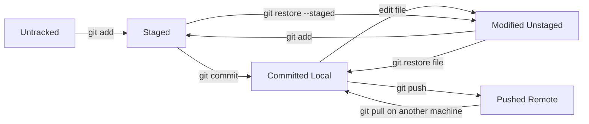
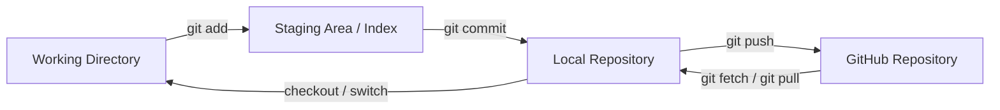
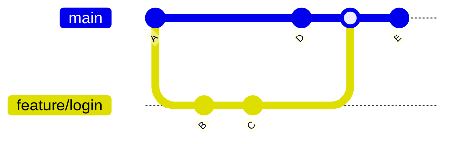
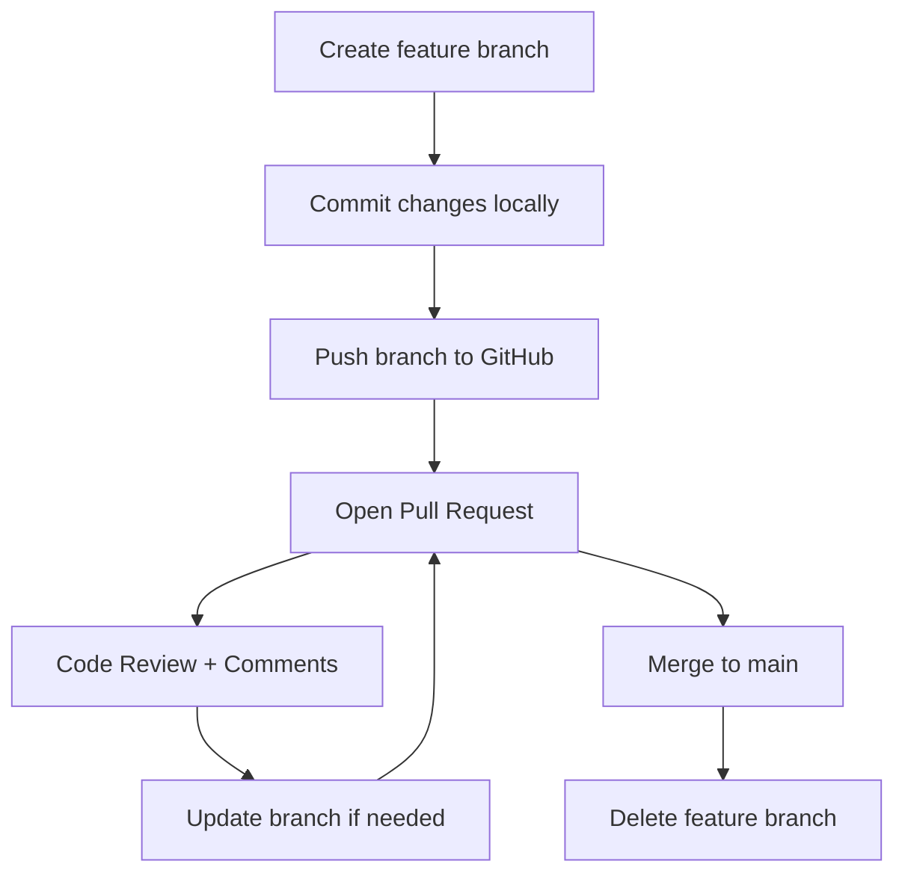
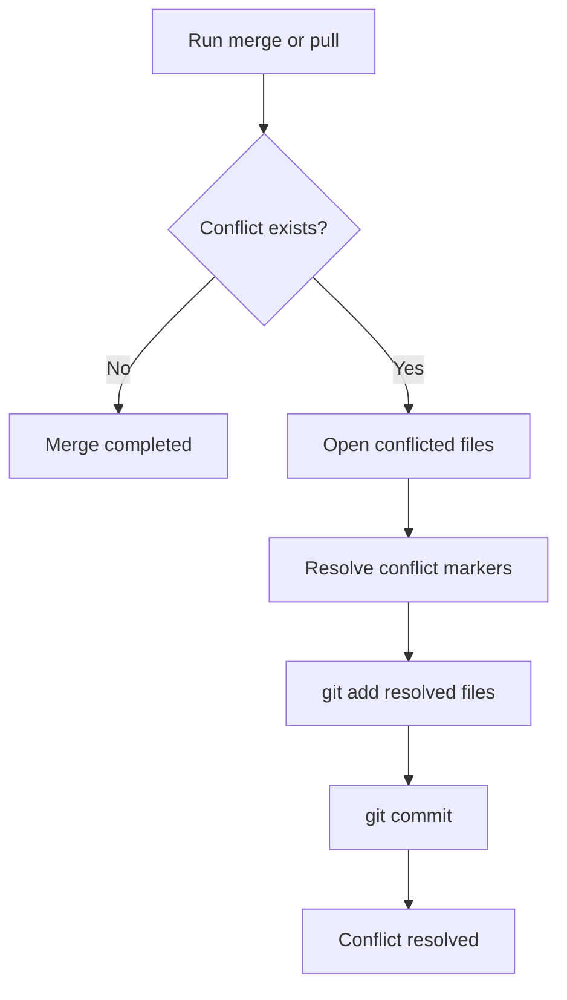
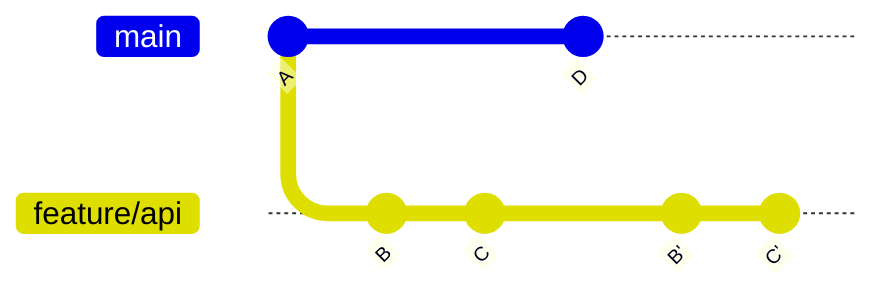
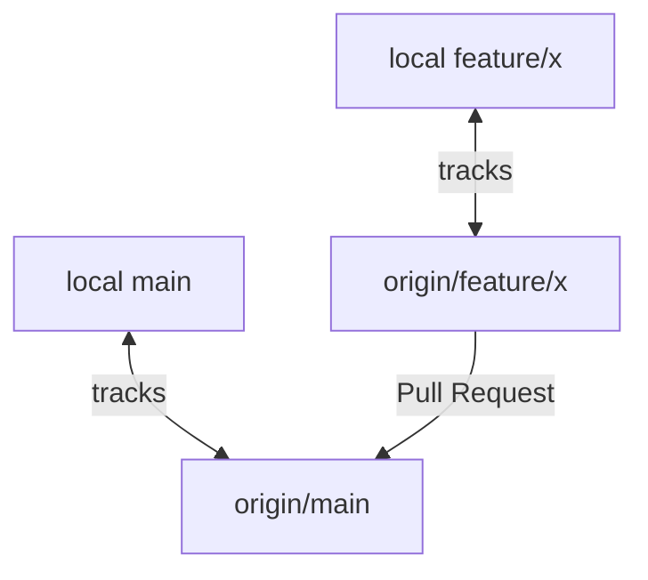
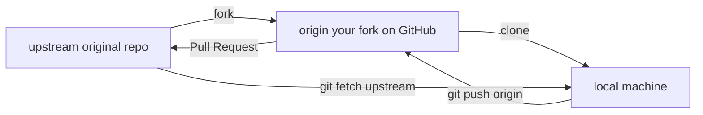
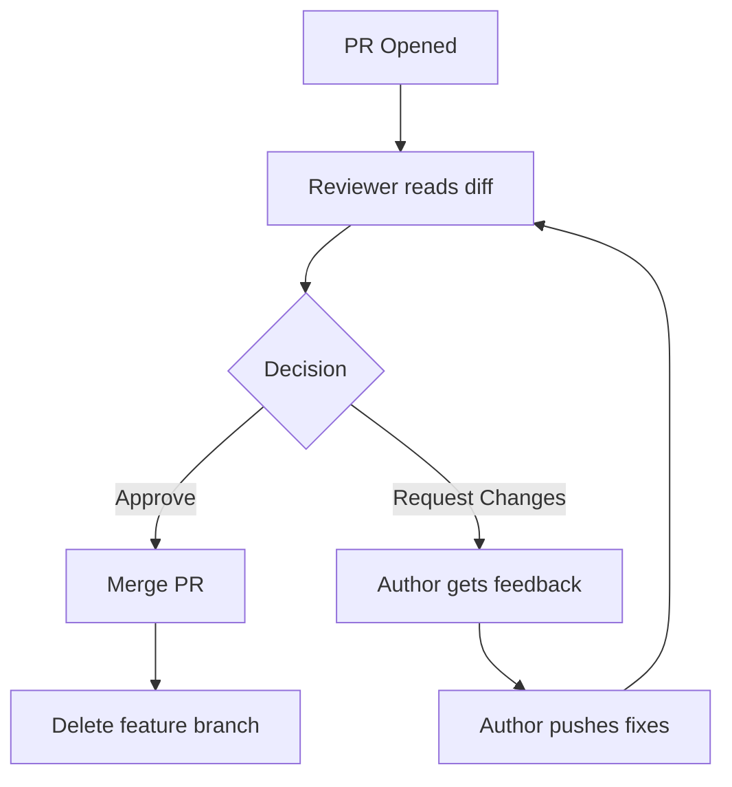

# Git and GitHub Training Guide (Basic to Intermediate)

## 1. Learning Goals
By the end of this guide, a fresher should be able to:
- Understand why version control matters.
- Use Git confidently on a local machine.
- Work with GitHub repositories and collaborate with teams.
- Follow a professional branch and pull request workflow.
- Resolve common conflicts and recover from common mistakes.

---

## 2. What Are Git and GitHub?
- **Git**: A distributed version control system used to track code changes locally and remotely.
- **GitHub**: A cloud platform that hosts Git repositories and enables collaboration (PRs, issues, code reviews, actions).

### Git vs GitHub
- Git is the **tool**.
- GitHub is the **platform/service** built around Git.

### Why Do We Need Version Control? (The Problem Story)
Imagine working without Git:
- You save: `report.txt`, `report_v2.txt`, `report_FINAL.txt`, `report_FINAL_USE_THIS.txt`
- You email files back and forth with teammates.
- Two people edit the same file and one overwrites the other's work.
- A bug appears and you have no idea which change caused it.

Git solves all of this:
- It tracks every change with who made it and when.
- Multiple people can work simultaneously without overwriting each other.
- You can go back to any previous state at any point.
- You can see exactly which commit introduced a bug.

---

## 3. Core Concepts (Must Know)
- **Repository (repo)**: Project folder tracked by Git.
- **Commit**: Snapshot of changes with a message.
- **Branch**: Independent line of development.
- **Merge**: Combine changes from one branch into another.
- **Remote**: Online copy of your repository (example: GitHub).
- **Clone**: Download a remote repo to local system.
- **Pull**: Fetch and integrate latest remote changes.
- **Push**: Upload local commits to remote.
- **Working directory**: Actual files on your machine.
- **Staging area (index)**: Pre-commit area for selected changes.
- **HEAD**: Pointer to current commit/branch.

---

## 4. Git Installation and Initial Setup

### Install Git
- macOS: `brew install git` (or install from official site)
- Windows: Git for Windows installer

- Linux: package manager (`apt`, `yum`, etc.)

### Verify Installation
```bash
git --version
```

### One-Time Configuration
```bash
git config --global user.name "Your Name"
git config --global user.email "you@example.com"
git config --global init.defaultBranch main
git config --global core.editor "code --wait"
```

### Check Configuration
```bash
git config --list
```

---

## 5. Basic Git Workflow (Local)

### Create and Initialize Repository
```bash
mkdir demo-project
cd demo-project
git init
```

### Check Status
```bash
git status
```

### Track Files and Commit
```bash
git add file1.txt
git commit -m "Add file1"
```

### Add All Changes
```bash
git add .
git commit -m "Add initial project files"
```

### View History
```bash
git log
git log --oneline --graph --decorate
```

---

## 6. Working with Changes

### See File Differences
```bash
git diff                # unstaged changes
git diff --staged       # staged changes
```

### Unstage a File
```bash
git restore --staged file1.txt
```

### Discard Uncommitted Changes
```bash
git restore file1.txt
```

### Rename and Delete Files
```bash
git mv old.txt new.txt
git rm unwanted.txt
git commit -m "Rename and remove files"
```

### Stage Only Part of a File (`git add -p`)
Instead of staging all changes in a file, review and stage individual chunks:
```bash
git add -p file1.txt
```
Git will walk through each change hunk and ask: `Stage this hunk? [y/n/q/?]`
- `y` = stage this chunk
- `n` = skip this chunk
- `q` = quit

Use this to create clean, focused commits even when a file has multiple unrelated edits.

### Remove Untracked Files (`git clean`)
Delete files that are not tracked by Git (useful for cleaning build artifacts):
```bash
git clean -n        # dry run: preview what would be deleted
git clean -f        # force delete untracked files
git clean -fd       # also delete untracked directories
```

---

## 7. Branching (Essential)

### Why Branch?
Branches allow parallel work without affecting stable code.

### Common Branch Commands
```bash
git branch                       # list branches
git branch feature/login         # create branch
git switch feature/login         # move to branch
# older alternative: git checkout feature/login
```

### Create + Switch in One Step
```bash
git switch -c feature/profile-page
```

### Merge Branch
```bash
git switch main
git merge feature/profile-page
```

### Merge Strategies
You can control how Git merges:

| Flag | Behaviour |
|------|-----------|
| `--ff` (default) | Fast-forward if possible, otherwise merge commit |
| `--no-ff` | Always create a merge commit (preserves branch history) |
| `--squash` | Combine all branch commits into one commit on target |
| `--ff-only` | Only allow if fast-forward is possible, abort otherwise |

```bash
git merge --no-ff feature/profile-page      # always creates merge commit
git merge --squash feature/profile-page     # squash into one commit, then git commit
git merge --ff-only feature/profile-page    # only if no divergence
```

Teams usually enforce `--no-ff` on `main` so history always shows which branch a feature came from.

### Delete Branch
```bash
git branch -d feature/profile-page
```

---

## 8. Merge Conflicts

### When Conflicts Happen
When Git cannot automatically combine overlapping changes.

### Conflict Resolution Flow
1. Run merge/pull and identify conflicted files.
2. Open file and resolve markers:
   - `<<<<<<< HEAD`
   - `=======`
   - `>>>>>>> branch-name`
3. Keep intended final code.
4. Stage resolved files: `git add <file>`
5. Complete merge: `git commit`

### Useful Command
```bash
git status
```

---

## 9. Remote Repositories and GitHub Basics

### Create Remote Link
```bash
git remote add origin https://github.com/<user>/<repo>.git
git remote -v
```

### First Push
```bash
git push -u origin main
```

### Regular Push/Pull
```bash
git pull origin main
git push origin main
```

### Clone Existing Repo
```bash
git clone https://github.com/<user>/<repo>.git
```

---

## 10. GitHub Platform Features (Must Teach)
- **Repository settings**: visibility, collaborators, default branch.
- **README**: project intro and setup instructions.
- **Issues**: bug/feature tracking.
- **Pull Requests (PRs)**: propose and review code changes.
- **Fork**: personal copy of someone else's repository.
- **Stars / Watch / Releases**: community and version publishing.
- **Protected branches**: avoid direct push to `main`.

---

## 11. Professional Collaboration Workflow

### Feature Branch + PR Workflow
1. Pull latest `main`.
2. Create feature branch.
3. Commit in small logical chunks.
4. Push feature branch.
5. Create Pull Request.
6. Address review comments.
7. Merge PR into `main`.
8. Delete feature branch.

### Commands Example
```bash
git switch main
git pull origin main
git switch -c feature/cart-total
# make changes
git add .
git commit -m "Implement cart total calculation"
git push -u origin feature/cart-total
```

---

## 12. Intermediate Git Concepts

### 12.1 Rebase
Rebase replays your commits on top of another branch, creating a linear history.
```bash
git switch feature/api
git rebase main
```

When to use:
- Clean branch history before PR.
- Keep feature branch updated without extra merge commits.

Caution:
- Avoid rebasing shared/public branches without team agreement.

### 12.2 Cherry-Pick
Copy a specific commit from one branch to another.
```bash
git cherry-pick <commit-hash>
```

### 12.3 Stash
Temporarily save uncommitted work.
```bash
git stash                            # save with auto-name
git stash push -m "WIP: login form"  # save with descriptive message
git stash list                       # see all stashes
git stash pop                        # apply latest and remove from stash
git stash apply stash@{1}            # apply specific stash without removing
git stash drop stash@{1}             # delete a specific stash
git stash clear                      # delete all stashes
```

### 12.4 Reset vs Revert
- `git reset`: move branch pointer (history rewriting, local cleanup).
- `git revert`: create new commit that undoes previous commit (safe for shared branches).

Examples:
```bash
git reset --soft HEAD~1
git reset --hard HEAD~1
git revert <commit-hash>
```

### 12.5 Reflog (Recovery Tool)
Shows where HEAD has been; useful to recover "lost" commits.
```bash
git reflog
```

### 12.6 Tags (Versioning)
```bash
git tag v1.0.0
git push origin v1.0.0
```
Use tags for releases.

### 12.7 Amend Last Commit
Fix the most recent commit's message or add forgotten files — before pushing:
```bash
git commit --amend -m "Corrected commit message"
```

Add a forgotten file to the last commit:
```bash
git add forgotten_file.txt
git commit --amend --no-edit    # amend without changing message
```

Caution: never amend a commit that has already been pushed to a shared branch.

### 12.8 Interactive Rebase (`git rebase -i`)
Powerful tool to clean up commit history before raising a PR:
```bash
git rebase -i HEAD~3    # interactive rebase of last 3 commits
```

Editor opens with commit list. Available actions per commit:

| Action | Meaning |
|--------|---------|
| `pick` | Keep commit as-is |
| `reword` | Keep commit but edit message |
| `squash` | Merge into previous commit |
| `fixup` | Same as squash but discard this message |
| `drop` | Delete commit entirely |
| `edit` | Pause and amend this commit |

Common use: squash multiple "WIP" commits into one clean commit before PR.

### 12.9 `git blame`
See who last changed each line of a file and in which commit:
```bash
git blame app.txt
git blame -L 10,20 app.txt    # only lines 10 to 20
```

Useful for:
- Understanding why a line of code exists.
- Finding the author of a bug-introducing change.

### 12.10 `git bisect`
Binary-search through commit history to find which commit introduced a bug:
```bash
git bisect start
git bisect bad                  # current state is broken
git bisect good <commit-hash>   # last known working state
```

Git checks out midpoint commits. Test each one, then:
```bash
git bisect good    # if this commit works
git bisect bad     # if this commit is broken
```

Git narrows down and prints the first bad commit. When done:
```bash
git bisect reset
```

---

## 13. .gitignore and Clean Repositories

### Why Use `.gitignore`
Avoid committing:
- Build artifacts
- Secrets
- Virtual environments
- OS/editor temp files

Example `.gitignore`:
```gitignore
__pycache__/
*.pyc
.env
.venv/
node_modules/
.DS_Store
```

---

## 14. Commit Best Practices
- Write clear messages: `type: short description`
- Keep commits small and focused.
- One logical change per commit.
- Avoid "final", "update", "changes" as commit messages.

Good examples:
- `feat: add user login validation`
- `fix: handle null profile image`
- `docs: update API setup steps`

---

## 15. Pull Request Best Practices
- PR title should explain what and why.
- Keep PRs focused and reviewable.
- Add screenshots for UI changes.
- Link related issue (`Closes #123`).
- Respond to review comments professionally.

---

## 16. Common Mistakes and Recovery
- Committed to wrong branch: use `git cherry-pick` and `git reset` carefully.
- Wrong commit message: `git commit --amend` (if not pushed).
- Accidentally deleted code: use `git restore` or `git reflog`.
- Diverged branch during pull: choose merge or rebase strategy intentionally.

---

## 17. GitHub Authentication (Current Best Practice)
- HTTPS + Personal Access Token (PAT) instead of password.
- Or SSH keys for passwordless secure auth.

### SSH Quick Steps
```bash
ssh-keygen -t ed25519 -C "you@example.com"
cat ~/.ssh/id_ed25519.pub
# Add key to GitHub -> Settings -> SSH and GPG keys
ssh -T git@github.com
```

---

## 18. Suggested 5-Session Teaching Plan

### Session 1: Foundations
- Version control basics
- Git vs GitHub
- Install and configure Git
- `init`, `status`, `add`, `commit`, `log`

### Session 2: Branching and Merging
- Branch lifecycle
- Merge basics
- Conflict handling exercise

### Session 3: GitHub Workflow
- Create repo, clone, push, pull
- Pull requests, reviews, issues
- Branch protection concept

### Session 4: Intermediate Commands
- Rebase, stash, cherry-pick, revert, reset, reflog
- Tagging and release basics

### Session 5: Real Team Simulation
- Work in multiple branches
- Resolve conflict
- Create PR and review each other
- Final retrospective and Q&A

---

## 19. Hands-On Exercises (Practice Lab)

### Exercise 1: Local Basics
1. Create repo.
2. Add two files and commit twice.
3. View `git log --oneline`.

### Exercise 2: Branch and Merge
1. Create `feature/about-page`.
2. Modify same line in `main` and feature branch.
3. Merge and resolve conflict.

### Exercise 3: GitHub Collaboration
1. Push repo to GitHub.
2. Create PR from feature branch.
3. Review and merge PR.

### Exercise 4: Recovery Drill
1. Make three commits.
2. Reset last commit.
3. Recover it using `git reflog`.

---

## 20. Quick Command Cheat Sheet
```bash
# Setup
git config --global user.name "Your Name"
git config --global user.email "you@example.com"

# Start / Clone
git init
git clone <repo-url>

# Daily
git status
git add .
git commit -m "message"
git pull
git push

# History
git log --oneline --graph --decorate
git reflog

# Branch
git switch -c feature/x
git switch main
git merge feature/x
git branch -d feature/x

# Intermediate
git stash
git stash pop
git rebase main
git cherry-pick <hash>
git revert <hash>
```

---

## 21. Interview/Assessment Questions for Freshers
- What is the difference between Git and GitHub?
- What is the difference between `git fetch` and `git pull`?
- Explain staging area in Git.
- Merge vs rebase: when would you use each?
- What is a pull request and why is code review important?
- Difference between `git reset` and `git revert`?
- How do you resolve a merge conflict?

---

## 22. Final Teaching Tips
- Demonstrate every concept live in terminal.
- Ask learners to predict command output before execution.
- Use small repos with realistic file names.
- Prefer many short exercises over one long lecture.
- Encourage writing meaningful commit messages from day 1.

---

## 23. Optional Advanced Topics (After Intermediate)
- Git hooks
- GitHub Actions (CI/CD basics)
- CODEOWNERS and review policies
- Semantic versioning and release notes
- Monorepo strategies

This guide is designed to make a fresher job-ready for daily Git and GitHub usage in team projects.

---

## 24. Git File States and Lifecycle (Most Important)

### 24.1 The 4 Areas in Git
1. **Working Directory**: Where you create and edit files.
2. **Staging Area (Index)**: Where you prepare selected changes for the next commit.
3. **Local Repository**: Where commits are permanently stored on your machine.
4. **Remote Repository (GitHub)**: Shared repository for collaboration.

### 24.2 File States You Must Teach
- **Untracked**: New file, not yet tracked by Git.
- **Tracked + Unmodified**: File is tracked and unchanged since last commit.
- **Tracked + Modified (Unstaged)**: File changed in working directory but not staged yet.
- **Staged**: File selected for next commit using `git add`.
- **Committed**: Snapshot saved to local repository using `git commit`.
- **Pushed**: Local commit uploaded to remote using `git push`.

### 24.3 Lifecycle of Code (Step-by-Step)
```bash
# 1) Create or edit code in working directory
echo "v1" > app.txt

# 2) Check state
git status

# 3) Move change to staging area
git add app.txt

# 4) Review staged content
git diff --staged

# 5) Commit to local repository
git commit -m "Add app file"

# 6) Push to GitHub remote repository
git push origin main
```

### 24.4 State Transition Diagram


---

## 25. Visual Diagrams for Classroom Teaching

### 25.1 Git Architecture: Local to Remote


### 25.2 Branching and Merge Flow


### 25.3 Feature Branch to Pull Request Flow


### 25.4 Merge Conflict Resolution Flow


### 25.5 Rebase Flow (Clean History)


### 25.6 Local and Remote Tracking Branches


---

## 26. Additional Theory Concepts Freshers Commonly Miss

### 26.1 HEAD and Detached HEAD
- **HEAD** points to your current commit (usually through a branch name).
- **Detached HEAD** means HEAD points directly to a commit, not a branch.

### 26.2 Commit Graph (DAG)
Git history is a directed acyclic graph, not only a straight line. This explains merges, branches, and ancestry.

### 26.3 Fast-Forward Merge vs 3-Way Merge
- **Fast-forward**: branch pointer simply moves ahead.
- **3-way merge**: creates an explicit merge commit when histories diverge.

### 26.4 `git fetch` vs `git pull`
- `git fetch`: downloads remote changes only.
- `git pull`: `fetch` + integrate changes (merge or rebase).

### 26.5 Merge vs Rebase (Decision Rule)
- Use **merge** when you want to preserve exact branch history.
- Use **rebase** when you want clean linear history on feature branches.

### 26.6 Reset Modes
- `--soft`: move HEAD, keep changes staged.
- `--mixed` (default): move HEAD, unstage changes, keep file edits.
- `--hard`: move HEAD and discard working/staged changes.

### 26.7 Revert for Shared Branches
Prefer `git revert` on shared branches because it creates a safe undo commit without rewriting public history.

### 26.8 Reflog for Recovery
`git reflog` helps recover commits after reset, rebase, or accidental branch movement.

### 26.9 Upstream Tracking
After first push with `git push -u origin <branch>`, future `git push` and `git pull` can run without full branch names.

### 26.10 Fork and Upstream Model
In open source workflows:
- `origin` usually points to your fork.
- `upstream` points to original repository.
- Sync your fork using `git fetch upstream` and merge/rebase from upstream main.

### 26.11 Squash Merge
Squash merge combines many feature branch commits into one commit on `main`, keeping history concise.

### 26.12 Branch Protection and Review Policies
Teams often enforce:
- no direct push to `main`
- at least 1 reviewer approval
- passing checks before merge

---

## 27. One-Line Memory Aid for Freshers
"Edit in working directory, stage with `git add`, snapshot with `git commit`, share with `git push`, collaborate via PR, and merge to main."

---

## 28. `.git` Folder Internals (Conceptual Overview)

Every Git repository has a hidden `.git` folder — this IS the repository.

```
.git/
├── HEAD          → points to current branch ref
├── config        → local repo config
├── objects/      → all commits, trees, blobs stored as SHA hashes
│   ├── commits
│   ├── trees (directory snapshots)
│   └── blobs (file contents)
├── refs/
│   ├── heads/    → local branch pointers
│   └── remotes/  → remote branch pointers
├── index         → staging area state
└── logs/         → reflog history
```

Key insight to teach freshers:
- Every commit is a snapshot of the whole project, not just diffs.
- Each object is identified by a SHA-1 hash of its content.
- Branches are just files containing a commit hash — extremely lightweight.
- Deleting a branch does not delete commits (recoverable via `git reflog`).

---

## 29. Working with Multiple Remotes

A local repo can connect to more than one remote — common in open source and fork workflows.

```bash
git remote -v                                    # list all remotes
git remote add upstream https://github.com/original/repo.git   # add second remote
git fetch upstream                               # download upstream changes
git merge upstream/main                          # integrate upstream main
```

### Fork + Upstream Diagram


### Typical sync workflow when contributing to open source:
```bash
git fetch upstream
git switch main
git merge upstream/main     # keep your local main updated
git push origin main        # sync your fork on GitHub
```

---

## 30. Pull Request Review Process (GitHub UI Walkthrough)

### Roles in a PR
- **Author**: creates the PR, responds to feedback.
- **Reviewer**: reads the diff, leaves comments, approves or requests changes.

### Step-by-Step PR Review Flow
1. Open PR on GitHub — review the **Files Changed** tab.
2. Click `+` next to a line to leave an inline comment.
3. Choose one of:
   - **Comment**: general feedback, no decision.
   - **Approve**: code is ready to merge.
   - **Request changes**: must be addressed before merge.
4. Author receives notification and can:
   - Reply to comments.
   - Push new commits to the same branch (PR updates automatically).
   - Resolve comments once addressed.
5. All reviewers approve and required checks pass — PR is ready to merge.
6. Merge using preferred strategy (merge commit / squash / rebase).
7. Delete feature branch after merge.

### PR Review Diagram


### What Makes a Good PR Review Comment?
- Be specific: point to exact line and explain why.
- Distinguish blocking vs non-blocking: use prefixes like `nit:` for minor style suggestions.
- Suggest code, not just problems: use GitHub's *suggestion* feature.
- Keep tone professional and constructive.

